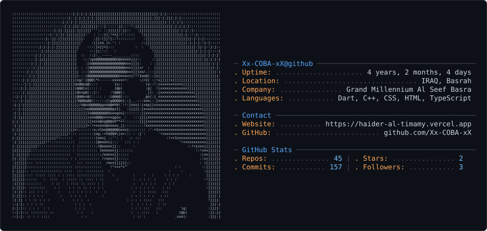

<div align="center">

<picture>
  <source media="(prefers-color-scheme: dark)" srcset="dark_mode.svg" />
  <source media="(prefers-color-scheme: light)" srcset="light_mode.svg" />
  
</picture>

<br>


### Software Engineer · Flutter Developer

*Building scalable apps with Flutter, Node.js & Next.js — exploring AI, backend systems & modern software architecture.*

</div>

<br>

<table align="center">
<tr>
<td valign="top" width="50%">

### ⟡ About

```
company     Grand Millennium Al Seef Basra
location    Basrah, Iraq
site        haider-al-timamy.vercel.app
focus       Flutter · Next.js · TypeScript
currently   Building T Store App
learning    Node.js · Express · MongoDB
```

</td>
<td valign="top" width="50%">

### ⟡ Connect

<div>
<a href="mailto:haider.new.it@gmail.com"></a>
<a href="https://www.linkedin.com/in/haider-al-tamimi-45022b266/"></a>
<br>
<a href="https://haider-al-timamy.vercel.app"></a>
<a href="https://t.me/dev_7aider"></a>
<br>
<a href="https://www.instagram.com/dev_7aider/"></a>
<a href="https://ko-fi.com/V7V4RAK9C"></a>
</div>

</td>
</tr>
</table>

<div align="center">

</div>

<div align="center">

### ⟡ Craft


<br>


<br>


</div>

<br>

<div align="center">

</div>

<div align="center">

### ⟡ Statistics


</div>

<br>

<div align="center">


<sub>Thanks for stopping by ✦ </sub>

</div>
